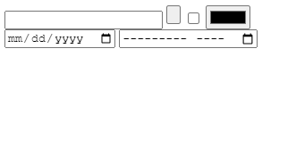
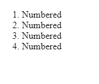
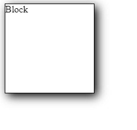

# WEB-LAB-3

<p align = "center">МИНИСТЕРСТВО НАУКИ И ВЫСШЕГО ОБРАЗОВАНИЯ<br>
РОССИЙСКОЙ ФЕДЕРАЦИИ<br>
ФЕДЕРАЛЬНОЕ ГОСУДАРСТВЕННОЕ БЮДЖЕТНОЕ<br>
ОБРАЗОВАТЕЛЬНОЕ УЧРЕЖДЕНИЕ ВЫСШЕГО ОБРАЗОВАНИЯ<br>
«САХАЛИНСКИЙ ГОСУДАРСТВЕННЫЙ УНИВЕРСИТЕТ»</p>
<br><br><br><br><br><br>
<p align = "center">Институт естественных наук и техносферной безопасности<br>Кафедра информатики<br>Шинкаренко Кирилл Константинович</p>
<br><br><br>
<p align = "center"><br><strong>Лабораторная работа №3.</strong><br>01.03.02 Прикладная математика и информатика</p>
<br><br><br><br><br><br><br><br><br><br><br><br>
<p align = "right">Научный руководитель<br>
Соболев Евгений Игоревич</p>
<br><br><br>
<p align = "center">г. Южно-Сахалинск<br>2024 г.</p>
<br><br><br><br><br><br><br><br><br><br><br><br>

<h1 align = "center">Введение</h1>
<p><b>HTML</b> —  стандартизированный язык гипертекстовой разметки документов для просмотра веб-страниц в браузере. Веб-браузеры получают HTML документ от сервера по протоколам HTTP/HTTPS или открывают с локального диска, далее интерпретируют код в интерфейс, который будет отображаться на экране монитора.</p>
<p><b>CSS</b> — формальный язык описания внешнего вида документа, написанного с использованием языка разметки. Также может применяться к любым XML-документам, например, к SVG или XUL.</p>

<br>
<h1 align = "center">Цели и задачи</h1>

1. Создать все виды заголовков с текстом "Hello world" c классом "heading".

2. Каждому заголовку также дать id (к прим. heading-1, heading-2...)

3. Задать всем заголовкам цвет текста на красный

4. Второму заголовку синий

5. Третьему заголовку поменять задний фон на чёрный

6. Четвертому заголовку сделать border и округлить углы

7. Пятому заголовку создать :hover эффект (любой)

 8. Создайте 6 input с разными типами.

9. Создать нумерованный список из 4 элементов с текстом “Нумерованный”.

10. Создать маркированный список из 4 элементов с текстом “Маркированный” и квадратным маркером.

11. Создайте веб-страницу с зеленым фоном и белым текстом из 30 слов.

12. Создать 6 блоков с нумерацией и такими параметрами (ширина 100px и высота 100px, зеленого цвета , внешним отступом 10px). Их родительским элементом должен быть container.

13. Поставить все блоки по центру страницы.

14. Добавьте тэг iframe на вашу страницу.
15. Сделайте простую форму регистрации на сайте (Только верстка).

16. Сделайте таблицу на странице.
17. Создайте стиль для заголовка h1 с красным цветом текста.

18. Установите шрифт Arial для всех параграфов на странице.

19. Добавьте тень на блок div с помощью свойства box-shadow.

20. Установите фоновый цвет "#f0f0f0" для всего документа.

21. Создайте анимацию, которая будет мигать красным цветом.

22. Установите отступы внутри блока div с помощью свойства padding.

23. Создайте стиль для ссылок, которые будут менять цвет при наведении на них курсора.

24. Добавьте границу вокруг изображения с помощью свойства border.

25. Создайте стиль для списка ul с маркерами в виде квадратов.

26. Установите ширину и высоту блока div с помощью свойств width и height.

27. Создайте стиль для таблицы, который будет делать каждую вторую строку серой.

28. Добавьте эффект перехода при наведении на кнопку с помощью свойства transition.

29. Установите фоновое изображение для элемента с помощью свойства background-image.

30. Создайте стиль для формы с полями для ввода текста и кнопкой отправки.

31. Добавьте рамку вокруг текстового поля с помощью свойства outline.

32. Установите выравнивание текста по центру в блоке div с помощью свойства text-align.

33. Создайте стиль для выпадающего меню с помощью псевдоэлемента :hover.

34. Добавьте тень на текст с помощью свойства text-shadow.

35. Создайте стиль для анимации появления элемента на странице с помощью свойства opacity.

36. Установите шрифт размером 18 пикселей для всех заголовков на странице.

<h1 align="center">Решение</h1>
<h2 align="center">Файл 1-3.html</h2>

```
<!DOCTYPE html>

<html lang="en">

<head>

    <meta charset="UTF-8">

    <meta name="viewport" content="width=device-width, initial-scale=1.0">

    <link rel="stylesheet" href="/styles/1-3.css">

    <title>Document</title>

    <style>

        .heading {

            color: red;

        }

    </style>

</head>

<body>

    <h1 class="heading" id="heading-1">Hello World!</h1>

    <h2 class="heading" id="heading-2">Hello World!</h2>

    <h3 class="heading" id="heading-3">Hello World!</h3>

    <h4 class="heading" id="heading-4">Hello World!</h4>

    <h5 class="heading" id="heading-5">Hello World!</h5>

    <h6 class="heading" id="heading-6">Hello World!</h6>

</body>

</html>
```

<h2 align="center">Файл 4.html</h2>

```
<!DOCTYPE html>

<html lang="en">

<head>

    <meta charset="UTF-8">

    <meta name="viewport" content="width=device-width, initial-scale=1.0">

    <link rel="stylesheet" href="/styles/1-3.css">

    <title>Document</title>

    <style>

        .heading {

            color: red;

        }

  

        #heading-2 {

            color: blue;

        }

    </style>

</head>

<body>

    <h1 class="heading" id="heading-1">Hello World!</h1>

    <h2 class="heading" id="heading-2">Hello World!</h2>

    <h3 class="heading" id="heading-3">Hello World!</h3>

    <h4 class="heading" id="heading-4">Hello World!</h4>

    <h5 class="heading" id="heading-5">Hello World!</h5>

    <h6 class="heading" id="heading-6">Hello World!</h6>

</body>

</html>
```

<h2 align="center">Файл 5.html</h2>

```
<!DOCTYPE html>

<html lang="en">

<head>

    <meta charset="UTF-8">

    <meta name="viewport" content="width=device-width, initial-scale=1.0">

    <link rel="stylesheet" href="/styles/1-3.css">

    <title>Document</title>

    <style>

        .heading {

            color: red;

        }

  

        #heading-2 {

            color: blue;

        }

  

        #heading-3 {

            background-color: black;

        }

    </style>

</head>

<body>

    <h1 class="heading" id="heading-1">Hello World!</h1>

    <h2 class="heading" id="heading-2">Hello World!</h2>

    <h3 class="heading" id="heading-3">Hello World!</h3>

    <h4 class="heading" id="heading-4">Hello World!</h4>

    <h5 class="heading" id="heading-5">Hello World!</h5>

    <h6 class="heading" id="heading-6">Hello World!</h6>

</body>

</html>
```

<h2 align="center">Файл 6.html</h2>

```
<!DOCTYPE html>

<html lang="en">

<head>

    <meta charset="UTF-8">

    <meta name="viewport" content="width=device-width, initial-scale=1.0">

    <link rel="stylesheet" href="/styles/1-3.css">

    <title>Document</title>

    <style>

        .heading {

            color: red;

        }

  

        #heading-2 {

            color: blue;

        }

  

        #heading-3 {

            background-color: black;

        }

  

        #heading-4 {

            border: 1px solid black;

            border-radius: 16px;

        }

  

    </style>

</head>

<body>

    <h1 class="heading" id="heading-1">Hello World!</h1>

    <h2 class="heading" id="heading-2">Hello World!</h2>

    <h3 class="heading" id="heading-3">Hello World!</h3>

    <h4 class="heading" id="heading-4">Hello World!</h4>

    <h5 class="heading" id="heading-5">Hello World!</h5>

    <h6 class="heading" id="heading-6">Hello World!</h6>

</body>

</html>
```

<h2 align="center">Файл 7.html</h2>

```
<!DOCTYPE html>

<html lang="en">

<head>

    <meta charset="UTF-8">

    <meta name="viewport" content="width=device-width, initial-scale=1.0">

    <link rel="stylesheet" href="/styles/1-3.css">

    <title>Document</title>

    <style>

        .heading {

            color: red;

        }

  

        #heading-2 {

            color: blue;

        }

  

        #heading-3 {

            background-color: black;

        }

  

        #heading-4 {

            border: 1px solid black;

            border-radius: 16px;

        }

        #heading-5:hover {

            color: rgb(104, 55, 55);

            cursor: pointer;

        }

  

    </style>

</head>

<body>

    <h1 class="heading" id="heading-1">Hello World!</h1>

    <h2 class="heading" id="heading-2">Hello World!</h2>

    <h3 class="heading" id="heading-3">Hello World!</h3>

    <h4 class="heading" id="heading-4">Hello World!</h4>

    <h5 class="heading" id="heading-5">Hello World!</h5>

    <h6 class="heading" id="heading-6">Hello World!</h6>

</body>

</html>
```

<h2 align="center">Файл 8.html</h2>

```
<!DOCTYPE html>

<html lang="en">

<head>

    <meta charset="UTF-8">

    <meta name="viewport" content="width=device-width, initial-scale=1.0">

    <title>Document</title>

</head>

<body>

    <input type="text">

    <input type="button">

    <input type="checkbox">

    <input type="color">

    <input type="date">

    <input type="month">

</body>

</html>
```

<h2 align="center">Файл 9.html</h2>

```
<!DOCTYPE html>

<html lang="en">

<head>

    <meta charset="UTF-8">

    <meta name="viewport" content="width=device-width, initial-scale=1.0">

    <title>Document</title>

</head>

<body>

    <ol>

        <li>Numbered</li>

        <li>Numbered</li>

        <li>Numbered</li>

        <li>Numbered</li>

    </ol>

</body>

</html>
```

<h2 align="center">Файл 10.html</h2>

```
<!DOCTYPE html>

<html lang="en">

<head>

    <meta charset="UTF-8">

    <meta name="viewport" content="width=device-width, initial-scale=1.0">

    <title>Document</title>

</head>

<body>

    <ul>

        <li>Markered</li>

        <li>Markered</li>

        <li>Markered</li>

        <li>Markered</li>

    </ul>

</body>

</html>
```

<h2 align="center">Файл 11.html</h2>

```
<!DOCTYPE html>

<html lang="en">

<head>

    <meta charset="UTF-8">

    <meta name="viewport" content="width=device-width, initial-scale=1.0">

    <title>Document</title>

    <style>

        body {

            background-color: green;

        }

    </style>

</head>

<body>

    <p style="color: white;">Lorem ipsum dolor sit amet consectetur adipisicing elit. Maiores, nihil aspernatur non ipsa quasi enim officia error sed magni rerum? Expedita rem, labore ratione consequuntur tenetur iste totam assumenda dolore!</p>

</body>

</html>
```

<h2 align="center">Файл 12.html</h2>

```
<!DOCTYPE html>

<html lang="en">

<head>

    <meta charset="UTF-8">

    <meta name="viewport" content="width=device-width, initial-scale=1.0">

    <title>Document</title>

    <style>

        .container div {

            width: 100px;

            height: 100px;

            background-color: green;

            margin: 10px;

        }

    </style>

</head>

<body>

    <div class="container">

  

        <ol>

  

            <li>

                <div>

  

                </div>

            </li>

            <li>

                <div>

                </div>

            </li>

            <li>

                <div>

                </div>

            </li>

            <li>

                <div>

                </div>

            </li>

            <li>

                <div>

                </div>

            </li>

            <li>

                <div>

                </div>

            </li>

  

        </ol>

  

    </div>

</body>

</html>
```

<h2 align="center">Файл 13.html</h2>

```
<!DOCTYPE html>

<html lang="en">

<head>

    <meta charset="UTF-8">

    <meta name="viewport" content="width=device-width, initial-scale=1.0">

    <title>Document</title>

    <style>

        .container div {

            width: 100px;

            height: 100px;

            background-color: green;

            margin: 10px;

        }

  

        .container {

            display: flex;

            justify-content: center;

        }

    </style>

</head>

<body>

    <div class="container">

  

        <ol>

  

            <li>

                <div>

  

                </div>

            </li>

            <li>

                <div>

                </div>

            </li>

            <li>

                <div>

                </div>

            </li>

            <li>

                <div>

                </div>

            </li>

            <li>

                <div>

                </div>

            </li>

            <li>

                <div>

                </div>

            </li>

  

        </ol>

  

    </div>

</body>

</html>
```

<h2 align="center">Файл 14.html</h2>

```
<!DOCTYPE html>

<html lang="en">

<head>

    <meta charset="UTF-8">

    <meta name="viewport" content="width=device-width, initial-scale=1.0">

    <title>Document</title>

</head>

<body>

    <iframe width="800" height="600" src="https://www.youtube.com/embed/QnKxdhvJNcU?si=jNfPTmCdq8M2SxyF" title="YouTube video player" frameborder="0" allow="accelerometer; autoplay; clipboard-write; encrypted-media; gyroscope; picture-in-picture; web-share" referrerpolicy="strict-origin-when-cross-origin" allowfullscreen></iframe>

</body>

</html>
```

<h2 align="center">Файл 15.html</h2>

```
<!DOCTYPE html>

<html lang="en">

<head>

    <meta charset="UTF-8">

    <meta name="viewport" content="width=device-width, initial-scale=1.0">

    <style>

        * {

            padding: 0;

            margin: 0;

        }

  

        * {

    padding: 0;

    margin: 0;

    font-family: 'Segoe UI', Tahoma, Geneva, Verdana, sans-serif;

}

  

html {

    height: 100%;

}

  

body {

    height: 100%;

}

  

.container {

    height: 100%;

    display: flex;

    justify-content: center;

    align-items: center;

}

  

ul {

    list-style: none;

}

  

li {

    font-size: 22px;

    padding: 10px 0;

}

  

li:first-child {

    padding-top: 30px;

}

  

li:last-child {

    padding-bottom: 30px;

}

  

input {

    border: none;

    height: 30px;

    min-width: 350px;

    width: 100%;

    text-indent: 10px;

    border-radius: 5px;

    font-size: 18px;

}

  

button {

    border: none;

    position: relative;

    left: 50%;

    transform: translate(-50%, 0);

    padding: 15px;

    width: 150px;

    border-radius: 50px;

    font-size: 24px;

    font-weight: 500;

}

  

.registration {

    background-color: rgb(158, 173, 74);

    padding: 25px 60px 25px 60px;

    border-radius: 60px;

    max-width: 350px;

    box-shadow: 1px 1px 5px black;

}

  

h1 {

    display: flex;

    justify-content: center;

    font-size: 48px;

    font-weight: bold;

    color: white;

    border-bottom: 1px white solid;

}

  

#passwordHint {

    font-size: 12px;

    text-align: justify;

    margin-top: 10px;

    color: rgb(255, 255, 255);

}

    </style>

    <title>Document</title>

</head>

<body>

    <div class="container">

        <form id="registration" class="registration">

  

            <h1>SIGN UP</h1>

  

            <ul>

                <li>

                    <input id="name" type="text" placeholder="Name">

                </li>

                <li>

                    <input id="login" type="text" placeholder="Login">

                </li>

                <li>

                    <input id="email" type="email" placeholder="Email">

                </li>

                <li>

                    <input id="password" type="password" placeholder="Password">

                </li>

                <li>

                    <input id="passwordRepeat" type="password" placeholder="Repeat Password">

                </li>

            </ul>

  

            <button type="submit" form="registration">SignUp</button>

  

        </form>

    </div>

</body>

</html>
```

<h2 align="center">Файл 16.html</h2>

```
<!DOCTYPE html>

<html lang="en">

<head>

    <meta charset="UTF-8">

    <meta name="viewport" content="width=device-width, initial-scale=1.0">

    <title>Document</title>

    <style>

        tr, td, th {

            border: solid 1px black;

        }

  

        table {

            border-collapse: collapse;

            margin: auto;

        }

  

    </style>

</head>

<body>

    <table>

        <tr>

            <th>Заголовок1</th><th>Заголовок2</th><th>Заголовок3</th><th>Заголовок4</th>

        </tr>

        <tr>

            <td>Ячейка11</td><td>Ячейка12</td><td>Ячейка13</td><td>Ячейка14</td>

        </tr>

        <tr>

            <td>Ячейка21</td><td>Ячейка22</td><td>Ячейка23</td><td>Ячейка24</td>

        </tr>

        <tr>

            <td>Ячейка31</td><td>Ячейка32</td><td>Ячейка33</td><td>Ячейка34</td>

        </tr>

        <tr>

            <td>Ячейка41</td><td>Ячейка42</td><td>Ячейка43</td><td>Ячейка44</td>

        </tr>

    </table>

</body>

</html>
```

<h2 align="center">Файл 17.html</h2>

```
<!DOCTYPE html>

<html lang="en">

<head>

    <meta charset="UTF-8">

    <meta name="viewport" content="width=device-width, initial-scale=1.0">

    <title>Document</title>

    <style>

        h1 {

            color: red;

        }

    </style>

</head>

<body>

    <h1>Заголовок 1</h1>

</body>

</html>
```

<h2 align="center">Файл 18.html</h2>

```
<!DOCTYPE html>

<html lang="en">

<head>

    <meta charset="UTF-8">

    <meta name="viewport" content="width=device-width, initial-scale=1.0">

    <title>Document</title>

    <style>

        p {

            font-family: Arial, Helvetica, sans-serif;

        }

    </style>

</head>

<body>

    <p>Lorem ipsum dolor, sit amet consectetur adipisicing elit. Voluptatem, sit!</p>

    <p>Lorem ipsum dolor, sit amet consectetur adipisicing elit. Voluptatem, sit!</p>

    <p>Lorem ipsum dolor, sit amet consectetur adipisicing elit. Voluptatem, sit!</p>

    <p>Lorem ipsum dolor, sit amet consectetur adipisicing elit. Voluptatem, sit!</p>

    <p>Lorem ipsum dolor, sit amet consectetur adipisicing elit. Voluptatem, sit!</p>

    <p>Lorem ipsum dolor, sit amet consectetur adipisicing elit. Voluptatem, sit!</p>

</body>

</html>
```

<h2 align="center">Файл 19.html</h2>

```
<!DOCTYPE html>

<html lang="en">

<head>

    <meta charset="UTF-8">

    <meta name="viewport" content="width=device-width, initial-scale=1.0">

    <title>Document</title>

    <style>

        div {

            width: 150px;

            height: 150px;

            box-shadow: 5px 5px 16px black;

            border: 1px solid;

        }

    </style>

</head>

<body>

    <div>

        Block

    </div>

</body>

</html>
```

<h2 align="center">Файл 20.html</h2>

```
<!DOCTYPE html>

<html lang="en">

<head>

    <meta charset="UTF-8">

    <meta name="viewport" content="width=device-width, initial-scale=1.0">

    <title>Document</title>

    <style>

        html {

            background-color: #f0f0f0;

        }

    </style>

</head>

<body>

</body>

</html>
```

<h2 align="center">Файл 21.html</h2>

```
<!DOCTYPE html>

<html lang="en">

<head>

    <meta charset="UTF-8">

    <meta name="viewport" content="width=device-width, initial-scale=1.0">

    <style>

        html {

            height: 100%;

        }

  

        body{

            height: 99%;

        }

        .container{

            display: flex;

            height: 100%;

        }

  

        .anim {

            margin:auto;

            background-color: red;

            border:none;

            border-radius: 200px;

            width: 250px;

            height: 250px;

            animation: migaet 1s infinite alternate;

        }

  

        @keyframes migaet {

            0% {

                opacity: 0;

            }

  

            100%{

                opacity: 1;

            }

        }

  

    </style>

    <title>Document</title>

</head>

<body>

    <div class="container">

        <input class="anim" type="text">

    </div>

</body>

</html>
```

<h2 align="center">Файл 22.html</h2>

```
<!DOCTYPE html>

<html lang="en">

<head>

    <meta charset="UTF-8">

    <meta name="viewport" content="width=device-width, initial-scale=1.0">

    <title>Document</title>

    <style>

        div {

            background-color: aqua;

            width: 250px;

            margin: auto;

            padding: 20px;

        }

    </style>

</head>

<body>

    <div>

        <p>Lorem ipsum dolor sit amet, consectetur adipisicing elit. Dolor, vero!</p>

    </div>

</body>

</html>
```

<h2 align="center">Файл 23.html</h2>

```
<!DOCTYPE html>

<html lang="en">

<head>

    <meta charset="UTF-8">

    <meta name="viewport" content="width=device-width, initial-scale=1.0">

    <title>Document</title>

    <style>

        ul {

            list-style-type: none;

        }

  

        .conteiner {

            display: flex;

            justify-content: center;

        }

  

        .link {

            color: black;

            text-decoration: none;

        }

  

        .link:hover {

            color: blue;

            font-size: large;

        }

    </style>

</head>

<body>

  

    <div class="conteiner">

        <ul>

            <li>

                <a class="link" href="">Ref1</a>

            </li>

            <li>

                <a class="link" href="">Ref2</a>

            </li>

            <li>

                <a class="link" href="">Ref3</a>

            </li>

            <li>

                <a class="link" href="">Ref4</a>

            </li>

        </ul>

    </div>

</body>

</html>
```

<h2 align="center">Файл 24.html</h2>

```
<!DOCTYPE html>

<html lang="en">

<head>

    <meta charset="UTF-8">

    <meta name="viewport" content="width=device-width, initial-scale=1.0">

    <title>Document</title>

    <style>

        .image {

            border: 1px solid

        }

    </style>

</head>

<body>

    <div class="container">

        

    </div>

</body>

</html>
```

<h2 align="center">Файл 25.html</h2>

```
<!DOCTYPE html>

<html lang="en">

<head>

    <meta charset="UTF-8">

    <meta name="viewport" content="width=device-width, initial-scale=1.0">

    <title>Document</title>

    <style>

        ul {

            list-style-type: square;

        }

    </style>

</head>

<body>

    <ul>

        <li>item1</li>

        <li>item2</li>

        <li>item3</li>

        <li>item4</li>

        <li>item5</li>

    </ul>

</body>

</html>
```

<h2 align="center">Файл 26.html</h2>

```
<!DOCTYPE html>

<html lang="en">

<head>

    <meta charset="UTF-8">

    <meta name="viewport" content="width=device-width, initial-scale=1.0">

    <title>Document</title>

    <style>

        div{

            background-color: antiquewhite;

            width: 300px;

            height: 300px;

        }

    </style>

</head>

<body>

    <div>

        Block

    </div>

</body>

</html>
```

<h2 align="center">Файл 27.html</h2>

```
<!DOCTYPE html>

<html lang="en">

<head>

    <meta charset="UTF-8">

    <meta name="viewport" content="width=device-width, initial-scale=1.0">

    <title>Document</title>

    <style>

  

        table {

            table-layout: fixed;

            width: 100%;

            border-collapse: collapse;

            border: 1px solid rgb(0, 0, 0);

            text-align: center;

        }

  

        tr:nth-child(2n+1){

            background-color: gray;

        }

  

        tr:first-child {

            background-color: white;

        }

  

        tr, th, td {

            border: 1px solid black;

        }

  

    </style>

</head>

<body>

    <table>

        <tr>

            <th>ID</th><th>Товар</th><th>Цена</th><th>Описание</th>

        </tr>

        <tr>

            <td>1</td><td>Яблоки</td><td>250</td><td>Фуджи</td>

        </tr>

        <tr>

            <td>2</td><td>Помидоры</td><td>310</td><td>Большие, красные</td>

        </tr>

        <tr>

            <td>3</td><td>Груши</td><td>240</td><td>Японские</td>

        </tr>

        <tr>

            <td>4</td><td>Груши</td><td>240</td><td>Японские</td>

        </tr>

        <tr>

            <td>5</td><td>Груши</td><td>240</td><td>Японские</td>

        </tr>

        <tr>

            <td>6</td><td>Груши</td><td>240</td><td>Японские</td>

        </tr>

        <tr>

            <td>7</td><td>Груши</td><td>240</td><td>Японские</td>

        </tr>

        <tr>

            <td>8</td><td>Груши</td><td>240</td><td>Японские</td>

        </tr>

    </table>

</body>

</html>

</body>

</html>
```

<h2 align="center">Файл 28.html</h2>

```
<!DOCTYPE html>

<html lang="en">

<head>

    <meta charset="UTF-8">

    <meta name="viewport" content="width=device-width, initial-scale=1.0">

    <title>Document</title>

  

    <style>

        .btn {

            width: 150px;

            height: 50px;

            background-color: antiquewhite;

            border: none;

            border-radius: 15px;

            transition: background-color 0.5s;

        }

  

        .btn:hover {

            background-color: rgb(167, 122, 63);

        }

    </style>

</head>

<body>

    <button class="btn">Button</button>

</body>

</html>
```

<h2 align="center">Файл 29.html</h2>

```
<!DOCTYPE html>

<html lang="en">

<head>

    <meta charset="UTF-8">

    <meta name="viewport" content="width=device-width, initial-scale=1.0">

    <title>Document</title>

    <style>

        div {

            background-image: url("/img2.jpg");

            background-size: cover;

            height: 300px;

            width: 300px;

        }

    </style>

</head>

<body>

    <div>

        Block

    </div>

</body>

</html>
```

<h2 align="center">Файл 30.html</h2>

```
<!DOCTYPE html>

<html lang="en">

<head>

    <meta charset="UTF-8">

    <meta name="viewport" content="width=device-width, initial-scale=1.0">

    <link rel="stylesheet" href="/styles/22.css">

    <title>Document</title>

    <style>

        * {

    padding: 0;

    margin: 0;

    font-family: monospace;

}

  

html {

    height: 100%;

}

  

body {

    height: 100%;

    background: rgb(72,243,245);

background: linear-gradient(135deg, rgba(72,243,245,1) 0%, rgba(140,255,162,1) 50%, rgba(255,211,117,1) 100%);

}

  

.container {

    height: 100%;

    display: flex;

    justify-content: center;

    align-items: center;

}

  

ul {

    list-style: none;

}

  

li {

    font-size: 22px;

    padding: 10px 0;

}

  

li:first-child {

    padding-top: 30px;

}

  

li:last-child {

    padding-bottom: 30px;

}

  

input {

    border: none;

    height: 30px;

    min-width: 350px;

    width: 100%;

    text-indent: 10px;

    border-radius: 5px;

    font-size: 18px;

}

  

button {

    border: none;

    position: relative;

    left: 50%;

    transform: translate(-50%, 0);

    padding: 15px;

    width: 150px;

    border-radius: 16px;

    font-size: 24px;

  

}

  

.registration {

    background-color: rgb(84, 90, 145);

    padding: 25px 60px 25px 60px;

    border-radius: 16px;

    max-width: 350px;

}

  

h1 {

    display: flex;

    justify-content: center;

    font-size: 48px;

    font-weight: bold;

    color: white;

    border-bottom: 1px white solid;

}

  

#passwordHint {

    font-size: 12px;

    text-align: justify;

    margin-top: 10px;

    color: rgb(255, 255, 255);

}

    </style>

</head>

<body>

  

    <div class="container">

  

            <form id="registration" class="registration">

  

                <h1>SIGN UP</h1>

  

                <ul>

                    <li>

                        <input id="name" type="text" placeholder="Name">

                    </li>

                    <li>

                        <input id="login" type="text" placeholder="Login">

                    </li>

                    <li>

                        <input id="email" type="email" placeholder="Email">

                    </li>

                    <li>

                        <input id="password" type="password" placeholder="Password">

                        <p id="passwordHint">*Пароль дожен содержать хотя бы один заглавный символ, один строчный символ и хотя бы одну цифру и быть длиной не менее 6-ти символов</p>

                    </li>

                    <li>

                        <input id="passwordRepeat" type="password" placeholder="Repeat Password">

                    </li>

                </ul>

  

                <button type="submit" form="registration">SignUp</button>

  

            </form>

  

    </div>

  
  

    <script src="/scripts/22.js"></script>

</body>

</html>
```

<h2 align="center">Файл 31.html</h2>

```
<!DOCTYPE html>

<html lang="en">

<head>

    <meta charset="UTF-8">

    <meta name="viewport" content="width=device-width, initial-scale=1.0">

    <title>Document</title>

    <style>

        .container {

            display: flex;

            justify-content: center;

        }

        .outlineTry {

            outline: 2px dotted green;

            border: none;

            height: 100px;

        }

    </style>

</head>

<body>

    <div class="container">

        <input class="outlineTry" type="text">

    </div>

</body>

</html>
```

<h2 align="center">Файл 32.html</h2>

```
<!DOCTYPE html>

<html lang="en">

<head>

    <meta charset="UTF-8">

    <meta name="viewport" content="width=device-width, initial-scale=1.0">

    <style>

        html {

            height: 100%;

        }

  

        body {

            height: 100%;

        }

  

        .container-for-container {

            height: 100%;

            display: flex;

        }

  

        .container {

            width: 500px;

            margin: auto;

        }

  

        .container p {

            text-align: center;

        }

    </style>

    <title>Document</title>

</head>

<body>

    <div class="container-for-container">

        <div class="container">

            <p>Lorem ipsum dolor sit amet consectetur adipisicing elit. Facere tenetur aspernatur maiores veritatis vitae excepturi asperiores sit autem! Fugiat, itaque! Cupiditate qui ducimus temporibus aperiam ad libero consequuntur minus numquam?</p>

        </div>

    </div>

</body>

</html>
```

<h2 align="center">Файл 33.html</h2>

```
<!DOCTYPE html>

<html lang="en">

<head>

    <meta charset="UTF-8">

    <meta name="viewport" content="width=device-width, initial-scale=1.0">

    <title>Document</title>

    <style>

        body {

    padding: 0;

    margin: 0;

    display: block;

}

  

.nav {

    display: flex;

    background-color: rgb(49, 55, 109);

}

  

a {

    padding: 15px 40px;

    text-decoration: none;

    color: rgb(255, 255, 255);

    transition: all 0.3s;

}

  

a:hover {

    color: rgb(188, 188, 255);

}

  

.nav_heads {

    margin-right: auto;

    margin-left: auto;

    padding: 15px;

    display: flex;

}

  

.dropList {

    display: none;

    position: absolute;

    min-width: 100%;

}

  

.dropList a {

    color: rgb(255, 255, 255);

    padding: 12px 16px;

    text-decoration: none;

    display: block;

    background-color: #69698f;

    text-align: center;

    transition: all 0.3s;

}

  

.dropDown {

    position: relative;

    display: inline-block;

}

  

.dropDown:hover .dropList {

    display: block;

}

  

.dropList a:hover {

    background-color: #6f8399;

}

    </style>

</head>

<body>

    <div class="nav">

        <div class="nav_heads">

            <div>

                <a href="">Главная</a>

            </div>

  

            <div class="dropDown">

                <a href="" class="dropMenu">Меню</a>  

                <div class="dropList">

                    <a href="">1</a>

                    <a href="">2</a>

                    <a href="">3</a>

                </div>

            </div>

             <div>

                <a href="">Контакты</a>

             </div>

  

             <div>

                <a href="">О нас</a>

             </div>

        </div>

    </div>

</body>

</html>
```

<h2 align="center">Файл 34.html</h2>

```
<!DOCTYPE html>

<html lang="en">

<head>

    <meta charset="UTF-8">

    <meta name="viewport" content="width=device-width, initial-scale=1.0">

    <style>

        html {

            height: 100%;

        }

  

        body {

            height: 100%;

        }

  

        .container-for-container {

            height: 100%;

            display: flex;

        }

  

        .container {

            width: 500px;

            margin: auto;

        }

  

        .container p {

            font-family: monospace;

            text-align: center;

            text-shadow: 1px 2px 5px rgb(119, 0, 255);

            font-size: 24px;

        }

    </style>

    <title>Document</title>

</head>

<body>

    <div class="container-for-container">

        <div class="container">

            <p>Lorem ipsum dolor sit amet consectetur adipisicing elit. Facere tenetur aspernatur maiores veritatis vitae excepturi asperiores sit autem! Fugiat, itaque! Cupiditate qui ducimus temporibus aperiam ad libero consequuntur minus numquam?</p>

        </div>

    </div>

</body>

</html>v
```

<h2 align="center">Файл 35.html</h2>

```
<!DOCTYPE html>

<html lang="en">

<head>

    <meta charset="UTF-8">

    <meta name="viewport" content="width=device-width, initial-scale=1.0">

    <style>

        html {

            height: 100%;

        }

  

        body {

            height: 100%;

        }

  

        .container-for-container {

            height: 100%;

            display: flex;

        }

  

        .container {

            width: 500px;

            margin: auto;

        }

  

        .container p {

            font-family: monospace;

            text-align: center;

            text-shadow: 1px 2px 5px rgb(119, 0, 255);

            font-size: 24px;

            animation: 1s infinite alternate appear;

        }

  

        @keyframes appear {

            0% {

                opacity: 0;

            }

  

            25%{

                opacity: 0.25;

            }

  

            50%{

                opacity: 0.5;

            }

  

            75%{

                opacity: 0.75;

            }

  

            100%{

                opacity: 1;

            }

        }

    </style>

    <title>Document</title>

</head>

<body>

    <div class="container-for-container">

        <div class="container">

            <p>Lorem ipsum dolor sit amet consectetur adipisicing elit. Facere tenetur aspernatur maiores veritatis vitae excepturi asperiores sit autem! Fugiat, itaque! Cupiditate qui ducimus temporibus aperiam ad libero consequuntur minus numquam?</p>

        </div>

    </div>

</body>

</html>
```

<h2 align="center">Файл 36.html</h2>

```
<!DOCTYPE html>

<html lang="en">

<head>

    <meta charset="UTF-8">

    <meta name="viewport" content="width=device-width, initial-scale=1.0">

    <title>Document</title>

    <style>

        .heading {

            font-size: 18px;

            margin: 15px;

            padding: 0;

        }

    </style>

</head>

<body>

    <h1 class="heading">Hello World!</h1>

    <h2 class="heading">Hello World!</h2>

    <h3 class="heading">Hello World!</h3>

    <h4 class="heading">Hello World!</h4>

    <h5 class="heading">Hello World!</h5>

    <h6 class="heading">Hello World!</h6>

</body>

</html>
```

<h1 align = "center">Результат</h1>

<ol>
  <li>
    <div style="display: flex; flex-direction: column">
        <div>1-3</div>
        
    </div>
  </li>
  <li>
    <div style="display: flex; flex-direction: column">
        <div> 4</div>
        
    </div>
  </li>
  <li><div>5</div>
    
  </li>
    <li><div>6</div>
    
  </li>
  <li>
    <div style="display: flex; flex-direction: column">
        <div>7</div>
        
    </div>
  </li>
  <li>
    <div style="display: flex; flex-direction: column">
        <div>8</div>
        
    </div>
  </li>
  <li>
    <div style="display: flex; flex-direction: column">
        <div>9</div>
        
    </div>
  </li>
  <li>
    <div style="display: flex; flex-direction: column">
        <div>10</div>
        
    </div>
  </li>
  <li>
    <div style="display: flex; flex-direction: column">
        <div>11</div>
        
    </div>
  </li>
  <li>
    <div style="display: flex; flex-direction: column">
        <div>12</div>
        
    </div>
  </li>
  <li>
    <div style="display: flex; flex-direction: column">
        <div>13</div>
        
    </div>
  </li>
  <li>
    <div style="display: flex; flex-direction: column">
        <div>14</div>
        
    </div>
  </li>
  <li>
    <div style="display: flex; flex-direction: column">
        <div>15</div>
        
    </div>
  </li>
  <li>
    <div style="display: flex; flex-direction: column">
        <div>16</div>
        
    </div>
  </li>
  <li>
    <div style="display: flex; flex-direction: column">
        <div>17</div>
        
    </div>
  </li>
  <li>
    <div style="display: flex; flex-direction: column">
        <div>18</div>
        
    </div>
  </li>
  <li>
    <div style="display: flex; flex-direction: column">
        <div>19</div>
        
    </div>
  </li>
  <li>
    <div style="display: flex; flex-direction: column">
        <div>20</div>
        
    </div>
  </li>
  <li>
    <div style="display: flex; flex-direction: column">
        <div>21</div>
        
    </div>
  </li>
  <li>
    <div style="display: flex; flex-direction: column">
        <div>22</div>
        
    </div>
  </li>
  <li>
    <div style="display: flex; flex-direction: column">
        <div> 23</div>
        
    </div>
  </li>
  <li>
    <div style="display: flex; flex-direction: column">
        <div>24</div>
        
    </div>
  </li>
  <li>
    <div style="display: flex; flex-direction: column">
        <div>25</div>
        
    </div>
  </li>
  <li>
    <div style="display: flex; flex-direction: column">
        <div> 26</div>
        
    </div>
  </li>
    <li>
    <div style="display: flex; flex-direction: column">
        <div> 27</div>
        
    </div>
  </li>
    <li>
    <div style="display: flex; flex-direction: column">
        <div> 28</div>
        
    </div>
  </li>
    <li>
    <div style="display: flex; flex-direction: column">
        <div> 29</div>
        
    </div>
  </li>
    <li>
    <div style="display: flex; flex-direction: column">
        <div> 30</div>
        
    </div>
  </li>
    <li>
    <div style="display: flex; flex-direction: column">
        <div> 31</div>
        
    </div>
  </li>
    <li>
    <div style="display: flex; flex-direction: column">
        <div> 32</div>
        
    </div>
  </li>
    <li>
    <div style="display: flex; flex-direction: column">
        <div> 33</div>
        
    </div>
  </li>
    <li>
    <div style="display: flex; flex-direction: column">
        <div> 34</div>
        
    </div>
  </li>
    <li>
    <div style="display: flex; flex-direction: column">
        <div> 35</div>
        
    </div>
  </li>
    <li>
    <div style="display: flex; flex-direction: column">
        <div> 36</div>
        
    </div>
  </li>
</ol>
<h1 align = "center">Вывод</h1>
<p align="justify">По итогу проделанной лабораторной работы я научился создавать самые распространённые компоненты web-страниц. Улучшил навыки работы с HTML, CSS.</p>
